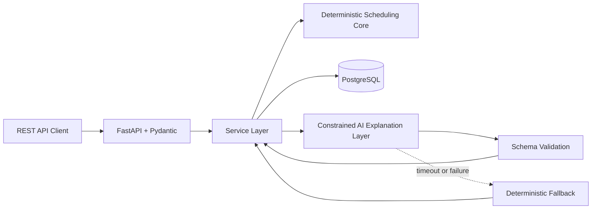

# Adaptive Revision Planner

> A reliable study-planning system built around a deterministic scheduling core and a constrained AI explanation layer.

## Project Status

**Gate A — deterministic core implementation.** The repository now contains a validated `Task` model, two initial calculation helpers, and deterministic priority ordering by deadline, importance, and `task_id`. The current suite has 20 passing `unittest` tests, including automated coverage of matrix scenarios S03, S04, and S07. Availability windows, block allocation, the API, persistence, and a runnable application have not been implemented yet.

## Why This Project Exists

Students often need to balance coursework, exams, projects, interview preparation, and changing daily availability. A normal to-do list records what needs to be done, but it does not answer three important questions:

1. Is the remaining work actually feasible before the deadlines?
2. How should limited study time be allocated across competing tasks?
3. What should change when the original plan is disrupted?

Adaptive Revision Planner is intended to answer those questions with reproducible scheduling logic. The project is also a hands-on vehicle for learning backend engineering, testing, databases, deployment, and reliable AI integration while producing evidence that can be discussed in software engineering interviews.

## Product Principles

- **Deterministic first:** the final schedule is produced by testable Python logic, not by an LLM.
- **Feasibility is explicit:** the system reports when the available time is insufficient instead of silently producing an unrealistic plan.
- **AI is constrained:** the AI layer may explain or summarize a plan, but it cannot override the scheduling engine or directly mutate core data.
- **Results are reproducible:** equivalent validated inputs should produce equivalent scheduling decisions.
- **Failure is handled safely:** AI timeouts, invalid outputs, and provider failures fall back to a non-AI explanation.
- **Engineering evidence matters:** tests, logs, CI, deployment instructions, and architecture documentation are first-class deliverables.

## Planned Core Features

- Manage users, courses, exams, tasks, and available study windows.
- Track deadlines, estimated effort, importance, and completion progress.
- Generate study blocks from remaining work and available time.
- Detect deadline conflicts and impossible workloads.
- Record completion and recalculate a disrupted plan.
- Expose the system through a validated REST API.
- Store application data in PostgreSQL.
- Explain schedules through a schema-validated AI layer with timeout and fallback behavior.

## Deterministic Scheduling Core

The scheduling engine is being implemented first as pure Python functions, independently of the API and database.

### Inputs

- Current time and planning horizon
- Tasks and exams
- Deadline for each task
- Estimated total effort
- Completed effort or completion percentage
- Importance or task weight
- Available study windows by day
- Minimum and maximum study-session length

### Outputs

- Ordered study blocks with task, date, start time, and duration
- Remaining unscheduled work
- Feasibility status
- Conflict and capacity warnings
- Machine-readable reason codes for important scheduling decisions
- Summary data that can be passed safely to the explanation layer

### Scheduling Factors

- Distance to deadline
- Importance
- Remaining effort
- Completion progress
- Daily availability
- Competing deadlines and exams
- Session-length constraints
- Insufficient total capacity

The reviewed algorithm matrix contains 15 scenarios covering equal deadlines, sufficient and insufficient capacity, unavailable days, importance-versus-urgency trade-offs, partial completion, disrupted plans, invalid effort values, and conflicting exams. S03, S04, and S07 are automated; the remaining scenarios still require implementation and verification.

## AI Responsibility Boundary

The AI layer may:

- Explain why a schedule was produced
- Summarize tasks and warnings
- Turn a complex plan into understandable study advice
- Generate bounded study tips from validated context

The AI layer may not:

- Generate or replace the final schedule
- Delete tasks or change deadlines
- Mark tasks as completed
- Write unvalidated output into core application data
- Bypass deterministic business rules

Planned reliability controls include structured output, schema validation, timeouts, error classification, latency and cost logging, a deterministic fallback, and at least 20 evaluation cases.

## Planned Architecture



## Planned Technology Stack

- Python
- FastAPI
- Pydantic
- PostgreSQL
- SQLAlchemy and Alembic
- Pytest
- Docker and Docker Compose
- GitHub Actions
- Structured logging
- An LLM provider behind a validated adapter

The exact dependencies will be selected when each implementation phase begins so the repository does not accumulate unused tooling.

## Scope

### Must Have

- Pure Python deterministic scheduling engine
- Algorithm-focused automated tests
- FastAPI REST API with Pydantic validation
- Service layer and PostgreSQL persistence
- Docker-based reproducible environment
- GitHub Actions CI
- Logging and error handling
- Stable deployment or fully reproducible deployment instructions
- English documentation and architecture diagram
- Constrained AI explanation layer with structured output, timeout, fallback, and evaluations

### Should Have

- User authentication and password hashing
- AI latency and cost metrics
- Audit log
- More detailed error classification
- Basic schedule history

### Could Have

At most one or two will be selected after the Must Have scope is stable:

- Retry policy
- Rate limiting
- Idempotent schedule-generation endpoint
- Caching for stable results
- Simple monitoring page

## Non-Goals

The first version is not intended to be:

- A generic to-do list
- An LLM chat wrapper
- A team project-management platform
- A feature-rich frontend application
- A full calendar synchronization product
- A system in which AI independently changes user data

## Implementation Roadmap

- [x] Define the problem and project positioning
- [x] Define initial users, stories, non-goals, and scope priorities
- [x] Define the deterministic core's initial input/output contract
- [x] Write and review the algorithm test matrix
- [x] Implement `Task` validation and stable priority ordering for S03, S04, and S07
- [ ] Implement the pure Python scheduling engine
- [ ] Add FastAPI, Pydantic models, and the service layer
- [ ] Add PostgreSQL persistence and migrations
- [ ] Add integration tests, logging, and error handling
- [ ] Add Docker and GitHub Actions
- [ ] Add the constrained AI explanation layer and evaluation suite
- [ ] Document deployment and publish a stable demo or reproducible deployment

## Running the Project

There is no application server or user interface yet. The current deterministic-core tests can be run from the repository root with:

```bash
python -m unittest
```

This command currently runs 20 tests. Passing tests demonstrate the checked behavior of the current implementation; they do not by themselves prove that the full scheduling engine or runnable application exists.

## Portfolio Evidence This Project Should Produce

- A documented scheduling algorithm with explicit trade-offs
- Automated tests covering difficult and failure cases
- A layered backend architecture with validated boundaries
- Database migrations and integration tests
- CI and reproducible deployment
- Measured AI failure handling rather than an untested API call
- A concise engineering write-up explaining decisions, limitations, and lessons learned

## License

No license has been selected yet.
